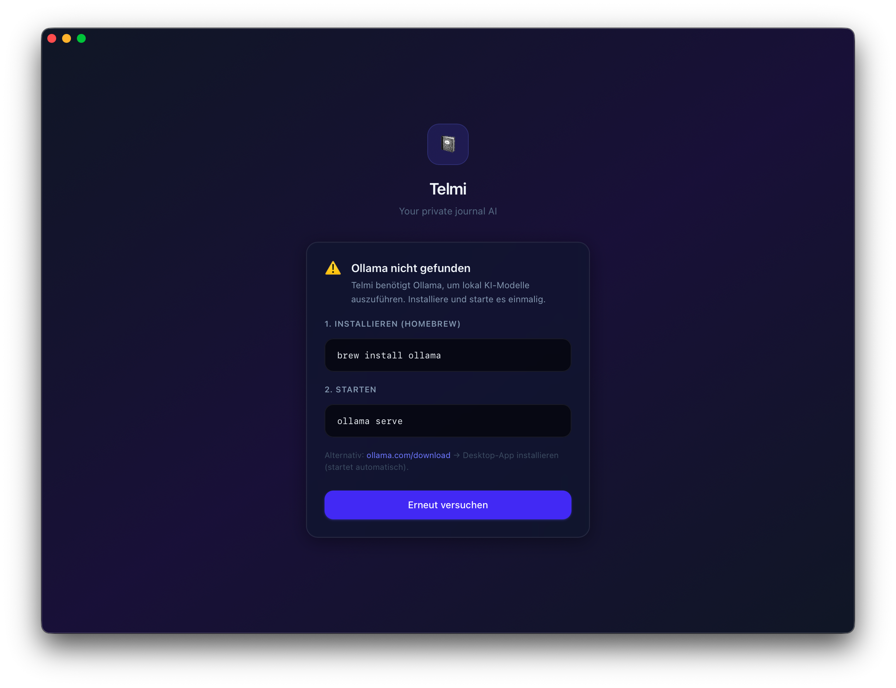
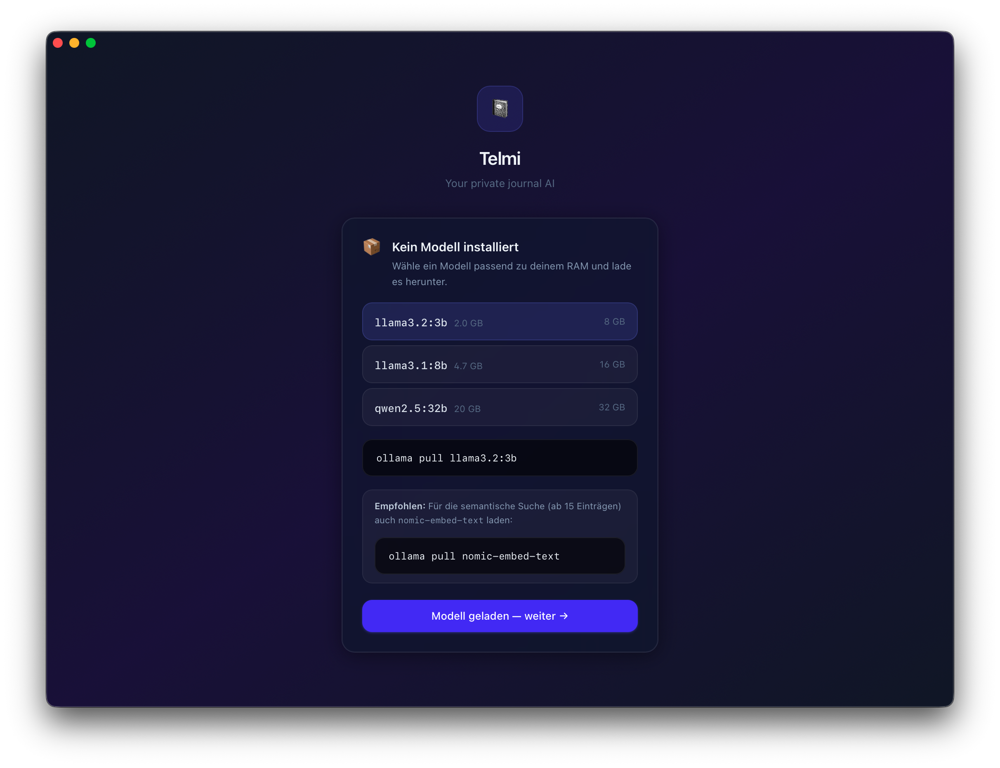
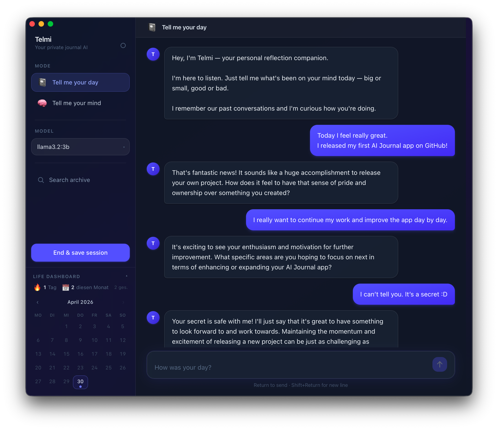
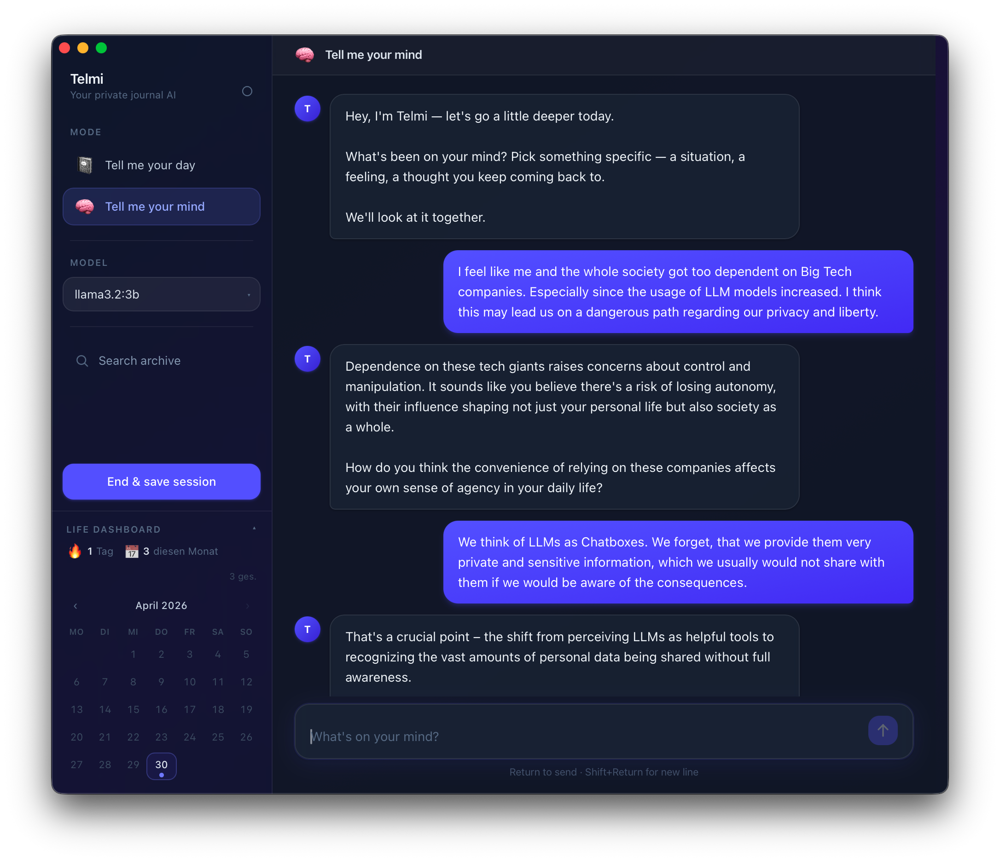
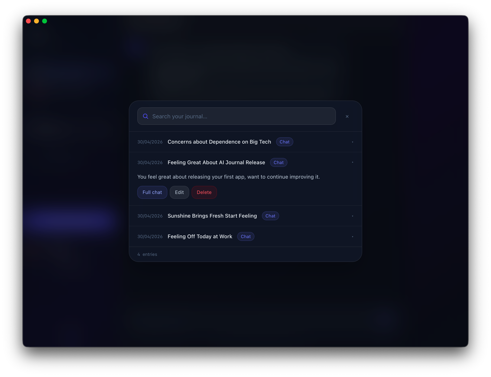

# Telmi — Local AI Journal

*Tell me your day. Tell me your mind.*

| Setup | Onboarding | Your Day | Your Mind | Archive |
| :---: | :---: | :---: | :---: | :---: |
| <a href="./screenshots/ollama_onboarding.png"></a> | <a href="./screenshots/model_onboarding.png"></a> | <a href="./screenshots/yourday_chat.png"></a> | <a href="./screenshots/yourmind_chat.png"></a> | <a href="./screenshots/archive_search.png"></a> |

Your thoughts stay on your machine. No cloud. No subscription. No one reading your diary.

Telmi is a native macOS journaling app powered by local AI. Talk about your day. Work through what's on your mind. Telmi listens, remembers, and gets better at knowing you — without sending a single word to a server.

---

## Two modes. One purpose.

**📓 Tell me your day** — a daily journaling space. Reflect on what happened, what you're feeling, what's next. Telmi asks follow-up questions and builds a running memory of your life over time.

**🧠 Tell me your mind** — a deeper mode for working things through. Telmi tracks what matters to you across sessions and refers back to it when relevant. A space to think out loud with something that actually remembers.

---

## What makes it different

- **Fully local.** Everything runs on your Mac. Nothing is ever sent to a server.
- **No subscription.** No API key. No usage limits. You own the models, you own the data.
- **Runs on 8 GB RAM.** No GPU required. Works on everyday hardware.
- **Remembers you.** Past conversations are stored and retrieved — Telmi doesn't start from scratch every time.
- **Life Dashboard.** A calendar showing every day you've written, streaks, and monthly stats — built into the sidebar.
- **Open models.** Switch between any model you have installed in Ollama. Upgrade when you want.

---

## Download

**→ [Latest release](../../releases/latest)** — download the `.dmg`, open it, drag Telmi to Applications.

> macOS only. Apple Silicon (M1 and later).

---

## Setup

Telmi guides you through setup on first launch. The only prerequisite is Ollama.

**1. Install [Ollama](https://ollama.com)**

Download the Ollama desktop app — it starts automatically in the background.

**2. Open Telmi**

The app detects whether Ollama is running and whether any models are installed. If something is missing, it tells you exactly what to do.

**Recommended models by RAM:**

| RAM    | Model            | Size   |
|--------|------------------|--------|
| 8 GB   | `llama3.2:3b`    | 2.0 GB |
| 16 GB  | `llama3.1:8b`    | 4.7 GB |
| 32 GB+ | `qwen2.5:32b`    | 20 GB  |

**Optional — semantic search** (activates automatically once you have 15+ entries):
```bash
ollama pull nomic-embed-text
```

---

## Build from source

Requirements: [Node.js](https://nodejs.org), [Rust](https://rustup.rs), [Python 3.11+](https://python.org), [Ollama](https://ollama.com)

```bash
# 1. Clone
git clone https://github.com/YOUR_USERNAME/telmi.git
cd telmi

# 2. Python dependencies (for the backend sidecar)
pip3 install -r requirements.txt

# 3. Build the backend binary
pyinstaller telmi-backend.spec --distpath frontend/src-tauri/binaries --noconfirm
# rename to match Tauri's expected name:
mv frontend/src-tauri/binaries/telmi-backend \
   frontend/src-tauri/binaries/telmi-backend-aarch64-apple-darwin

# 4. Run in development
cd frontend
npm install
npm run tauri dev
```

---

## Privacy

All data lives exclusively on your machine:

| File | Contents | Location |
|------|----------|----------|
| `memory.json` | Journal entries + chat history | App data directory |
| `profile.json` | Mind mode notes | App data directory |
| `chroma_db/` | Vector embeddings for search | App data directory |

None of these are included in this repository. Telmi never phones home.

---

## License

MIT — see [LICENSE](LICENSE).
